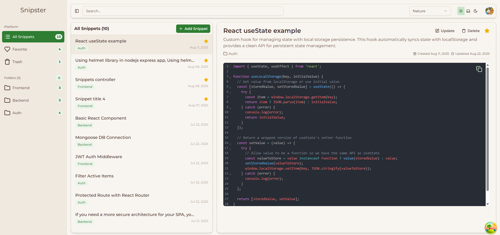
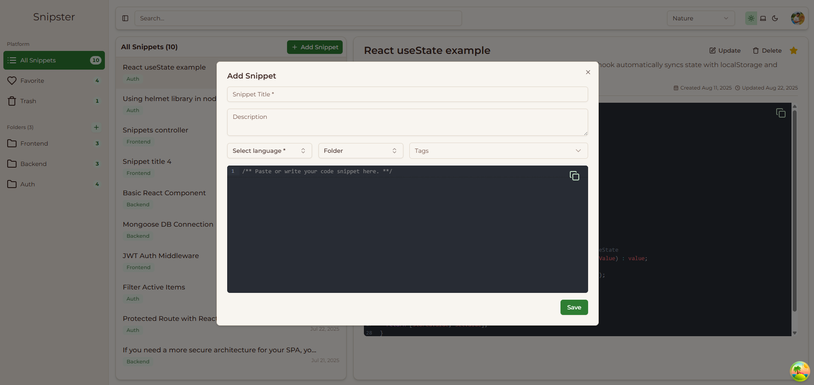

<h3 align="center">Snipster</h3>
<p align="center">
  <em>Where Code Finds Its Home.</em>
</p>

<p align="center">
  
  
  
  
</p>

<p align="center">Built with:</p>
<p align="center">
  
  
  
  
  
  
</p>

---

## 🔗 Table of Contents

- [📍 Overview](#-overview)
- [📸 Screenshots](#-screenshots)
- [📁 Project Structure](#-project-structure)
- [📁 Project Index](#-project-index)
- [🚀 Getting Started](#-getting-started)
  - [☑️ Prerequisites](#-prerequisites)
  - [⚙️ Installation & Running](#-installation--running)
  - [🤖 Usage](#-usage)
- [ 💄 Adding new theme](#-adding-new-theme)
- [📌 Project Roadmap](#-project-roadmap)
- [🔰 Contributing](#-contributing)
- [🎗 License](#-license)

---

## 📍 Overview

Snipster is an open-source snippet manager built for developers who value speed, organization, and collaboration. It allows you to save, search, and reuse your favorite code snippets across projects effortlessly. With a clean interface and powerful categorization, Snipster helps you eliminate repetitive coding, stay consistent, and boost productivity—whether you’re working on the frontend, backend, or full-stack applications.

---

## 📸 Screenshots

<p align="center">
  
</p>
<p align="center">
  
</p>

---

## 📁 Project Structure

```sh
snipster/
├── LICENSE
├── README.md
├── add-snippet.png
├── snipster-home.png
├── backend/
│   ├── config/
│   ├── controllers/
│   ├── models/
│   ├── routes/
│   ├── utils/
│   ├── index.ts
│   └── package.json
├── frontend/
│   ├── src/
│   ├── public/
│   ├── index.html
│   ├── vite.config.ts
│   └── package.json
└── package.json
```

---

### 📂 Project Index

<details open>
	<summary><b><code>SNIPSTER/</code></b></summary>
	<details> <!-- __root__ Submodule -->
		<summary><b>__root__</b></summary>
		<blockquote>
			<table>
			<tr>
				<td><b><a href='https://github.com/amitpatil321/snipster/blob/master/pnpm-lock.yaml'>pnpm-lock.yaml</a></b></td>
				<td>- The `pnpm-lock.yaml` file in the project structure serves as a lockfile to manage dependencies and versions for the project<br>- It ensures that the correct versions of dependencies like husky and lint-staged are installed, maintaining consistency and reproducibility in the codebase architecture.</td>
			</tr>
			<tr>
				<td><b><a href='https://github.com/amitpatil321/snipster/blob/master/lint-staged.config.js'>lint-staged.config.js</a></b></td>
				<td>Configures lint-staged to run ESLint on specific file types in the frontend and backend directories using custom ESLint configurations.</td>
			</tr>
			<tr>
				<td><b><a href='https://github.com/amitpatil321/snipster/blob/master/package.json'>package.json</a></b></td>
				<td>- Manage code linting and formatting using ESLint, Prettier, Husky, and lint-staged<br>- Ensure consistent code style and quality across the project<br>- Automatically fix issues and format code on commit<br>- Improve code maintainability and collaboration.</td>
			</tr>
			</table>
		</blockquote>
	</details>
	<details> <!-- backend Submodule -->
		<summary><b>backend</b></summary>
		<blockquote>
			<table>
			<tr>
				<td><b><a href='https://github.com/amitpatil321/snipster/blob/master/backend/pnpm-lock.yaml'>pnpm-lock.yaml</a></b></td>
				<td>- The `pnpm-lock.yaml` file in the backend directory of the project serves as a lockfile that specifies dependencies and their versions for the backend components<br>- It ensures that the correct versions of dependencies, such as compression and cookie-parser, are used to maintain consistency and stability in the project's architecture.</td>
			</tr>
			<tr>
				<td><b><a href='https://github.com/amitpatil321/snipster/blob/master/backend/tsconfig.json'>tsconfig.json</a></b></td>
				<td>Enforce strict type checking and skip checking declaration files in the TypeScript configuration to ensure consistent code quality and prevent unnecessary type errors throughout the project.</td>
			</tr>
			<tr>
				<td><b><a href='https://github.com/amitpatil321/snipster/blob/master/backend/globals.d.ts'>globals.d.ts</a></b></td>
				<td>Enhances Express server functionality by extending the Request interface to include OpenID Connect context, enabling seamless integration with authentication and authorization features.</td>
			</tr>
			<tr>
				<td><b><a href='https://github.com/amitpatil321/snipster/blob/master/backend/index.ts'>index.ts</a></b></td>
				<td>- Implements an Express server with various middleware for authentication, security, and request handling<br>- Defines routes for authentication, snippets, users, and tags, with error handling for unknown routes<br>- Utilizes rate limiting, CORS, and compression for enhanced performance and security<br>- Listens on a specified port for incoming requests.</td>
			</tr>
			<tr>
				<td><b><a href='https://github.com/amitpatil321/snipster/blob/master/backend/package.json'>package.json</a></b></td>
				<td>- Manage dependencies and scripts for the Snipster API backend, facilitating development with TypeScript and Node.js<br>- The file defines dev and build scripts, along with devDependencies and dependencies essential for running and building the project.</td>
			</tr>
			<tr>
				<td><b><a href='https://github.com/amitpatil321/snipster/blob/master/backend/eslint.config.js'>eslint.config.js</a></b></td>
				<td>Define ESLint configuration for TypeScript files, enforcing rules like '@typescript-eslint/no-unused-vars'.</td>
			</tr>
			</table>
			<details>
				<summary><b>config</b></summary>
				<blockquote>
					<table>
					<tr>
						<td><b><a href='https://github.com/amitpatil321/snipster/blob/master/backend/config/db.ts'>db.ts</a></b></td>
						<td>- Establishes MongoDB connection for the backend, ensuring seamless data storage and retrieval<br>- The code in db.ts configures the connection to the specified database URI, enabling the application to interact with the MongoDB database<br>- This critical functionality is essential for the backend to store and manage data effectively within the project architecture.</td>
					</tr>
					</table>
				</blockquote>
			</details>
			<details>
				<summary><b>controllers</b></summary>
				<blockquote>
					<table>
					<tr>
						<td><b><a href='https://github.com/amitpatil321/snipster/blob/master/backend/controllers/tags.controller.ts'>tags.controller.ts</a></b></td>
						<td>- Handles fetching and returning tags data from the database using Express and Mongoose<br>- The code ensures that authenticated users can access the tags information securely.</td>
					</tr>
					<tr>
						<td><b><a href='https://github.com/amitpatil321/snipster/blob/master/backend/controllers/snippet.controller.ts'>snippet.controller.ts</a></b></td>
						<td>- Provides functionality to manage snippets, including fetching counts, retrieving, saving, updating, toggling favorites, moving to folders, and toggling removal status<br>- Handles user-specific operations like filtering by user, favorite status, and folder<br>- Implements error handling for various scenarios to ensure data integrity and user experience.</td>
					</tr>
					<tr>
						<td><b><a href='https://github.com/amitpatil321/snipster/blob/master/backend/controllers/user.controller.ts'>user.controller.ts</a></b></td>
						<td>Retrieves user folders with snippet counts, enhancing data with snippet count information before returning a JSON response.</td>
					</tr>
					</table>
				</blockquote>
			</details>
			<details>
				<summary><b>models</b></summary>
				<blockquote>
					<table>
					<tr>
						<td><b><a href='https://github.com/amitpatil321/snipster/blob/master/backend/models/comments.schema.ts'>comments.schema.ts</a></b></td>
						<td>- Defines a schema for comments in the backend, linking them to snippets and users<br>- The schema enforces required fields and includes timestamps<br>- This code file plays a crucial role in structuring and organizing comments within the project's database architecture.</td>
					</tr>
					<tr>
						<td><b><a href='https://github.com/amitpatil321/snipster/blob/master/backend/models/user.schema.ts'>user.schema.ts</a></b></td>
						<td>- Defines the user schema for the backend, specifying essential fields like auth0Id, username, email, and passwordHash<br>- Additionally, includes optional fields for avatarUrl and bio<br>- The schema is designed to be stored in a MongoDB database using Mongoose, ensuring data integrity and timestamps for tracking updates.</td>
					</tr>
					<tr>
						<td><b><a href='https://github.com/amitpatil321/snipster/blob/master/backend/models/snippet.schema.ts'>snippet.schema.ts</a></b></td>
						<td>- Defines a Mongoose schema for snippets with fields like title, content, and language<br>- Associates snippets with folders, users, and tags<br>- Tracks favorites and deletion status.</td>
					</tr>
					<tr>
						<td><b><a href='https://github.com/amitpatil321/snipster/blob/master/backend/models/activity.schema.ts'>activity.schema.ts</a></b></td>
						<td>- Defines a schema for activity logs in the database, capturing user actions like creation, editing, deletion, and starring of snippets<br>- The schema includes references to users and snippets, ensuring data integrity and enabling tracking of user interactions within the system.</td>
					</tr>
					<tr>
						<td><b><a href='https://github.com/amitpatil321/snipster/blob/master/backend/models/folder.schema.ts'>folder.schema.ts</a></b></td>
						<td>- Defines a Mongoose schema for folders with name and userId fields, linked to the User model<br>- Enables creation of Folder model instances with timestamps.</td>
					</tr>
					<tr>
						<td><b><a href='https://github.com/amitpatil321/snipster/blob/master/backend/models/tags.schema.ts'>tags.schema.ts</a></b></td>
						<td>- Defines a schema for tags in the backend models, utilizing Mongoose for MongoDB interactions<br>- The schema includes a required name field and supports an optional userId for personal tags<br>- The model is exported as "Tag" for database operations.</td>
					</tr>
					</table>
				</blockquote>
			</details>
			<details>
				<summary><b>routes</b></summary>
				<blockquote>
					<table>
					<tr>
						<td><b><a href='https://github.com/amitpatil321/snipster/blob/master/backend/routes/user.routes.ts'>user.routes.ts</a></b></td>
						<td>- Defines user routes for accessing user data and folders in the backend architecture<br>- Handles authentication using Express middleware and returns user information if authenticated<br>- Exposes an endpoint to retrieve user folders<br>- Facilitates secure communication between the frontend and backend systems.</td>
					</tr>
					<tr>
						<td><b><a href='https://github.com/amitpatil321/snipster/blob/master/backend/routes/tags.routes.ts'>tags.routes.ts</a></b></td>
						<td>Expose endpoint for retrieving tags data by utilizing Express Router and linking to tags controller.</td>
					</tr>
					<tr>
						<td><b><a href='https://github.com/amitpatil321/snipster/blob/master/backend/routes/auth.routes.ts'>auth.routes.ts</a></b></td>
						<td>- Defines authentication routes for the backend, enabling user login and logout functionalities<br>- The code interacts with the Express framework to handle requests related to user authentication<br>- It leverages environment variables to manage the redirection URLs for login and logout actions, enhancing the security and user experience of the application.</td>
					</tr>
					<tr>
						<td><b><a href='https://github.com/amitpatil321/snipster/blob/master/backend/routes/snippet.routes.ts'>snippet.routes.ts</a></b></td>
						<td>- Defines routes for handling snippet operations such as fetching, saving, updating, and moving snippets to folders<br>- Also includes endpoints for toggling favorites, soft deleting, and retrieving snippet details and counts<br>- This file plays a crucial role in structuring the backend API for managing snippets within the project architecture.</td>
					</tr>
					</table>
				</blockquote>
			</details>
			<details>
				<summary><b>utils</b></summary>
				<blockquote>
					<table>
					<tr>
						<td><b><a href='https://github.com/amitpatil321/snipster/blob/master/backend/utils/withUser.ts'>withUser.ts</a></b></td>
						<td>- Enables handling requests with user authentication in Express backend<br>- Retrieves the user ID from the request object and ensures the user is authenticated before executing the provided handler function<br>- This middleware enhances security by verifying user identity before processing requests.</td>
					</tr>
					</table>
				</blockquote>
			</details>
		</blockquote>
	</details>
	<details> <!-- frontend Submodule -->
		<summary><b>frontend</b></summary>
		<blockquote>
			<table>
			<tr>
				<td><b><a href='https://github.com/amitpatil321/snipster/blob/master/frontend/prettier.config.js'>prettier.config.js</a></b></td>
				<td>Defines Prettier configuration for the frontend codebase, ensuring consistent code formatting.</td>
			</tr>
			<tr>
				<td><b><a href='https://github.com/amitpatil321/snipster/blob/master/frontend/tsconfig.node.json'>tsconfig.node.json</a></b></td>
				<td>- Configures TypeScript compiler options for the project's Node.js environment, enforcing strict type checking and linting rules<br>- Sets target to ES2023, module to ESNext, and module resolution to bundler mode<br>- Disables emitting output files and enables erasable syntax<br>- Includes Vite configuration file for bundler settings.</td>
			</tr>
			<tr>
				<td><b><a href='https://github.com/amitpatil321/snipster/blob/master/frontend/pnpm-lock.yaml'>pnpm-lock.yaml</a></b></td>
				<td>- The `frontend/pnpm-lock.yaml` file in the project structure serves as a lockfile for managing dependencies in the frontend application<br>- It ensures version consistency and dependency resolution for packages like "@auth0/auth0-react" and "@codemirror/lang-cpp"<br>- This file plays a crucial role in maintaining a stable and reliable frontend architecture by specifying the exact versions of dependencies required for the project.</td>
			</tr>
			<tr>
				<td><b><a href='https://github.com/amitpatil321/snipster/blob/master/frontend/tsconfig.json'>tsconfig.json</a></b></td>
				<td>- Defines strict compiler options and path mappings for TypeScript files in the project, ensuring type safety and module resolution<br>- References configuration files for the application and Node.js environments to maintain consistency across the codebase.</td>
			</tr>
			<tr>
				<td><b><a href='https://github.com/amitpatil321/snipster/blob/master/frontend/settings.json'>settings.json</a></b></td>
				<td>Enables automatic code formatting and real-time linting status display in the project's code editor.</td>
			</tr>
			<tr>
				<td><b><a href='https://github.com/amitpatil321/snipster/blob/master/frontend/tsconfig.app.json'>tsconfig.app.json</a></b></td>
				<td>- Defines TypeScript compiler options for the project, specifying target version, module resolution, and strict linting rules<br>- Maps module paths for easier imports across the codebase<br>- Facilitates bundling and ensures type safety and code consistency.</td>
			</tr>
			<tr>
				<td><b><a href='https://github.com/amitpatil321/snipster/blob/master/frontend/pnpm-workspace.yaml'>pnpm-workspace.yaml</a></b></td>
				<td>Define built dependencies for the frontend project using TailwindCSS Oxide and esbuild in the pnpm workspace configuration file.</td>
			</tr>
			<tr>
				<td><b><a href='https://github.com/amitpatil321/snipster/blob/master/frontend/package.json'>package.json</a></b></td>
				<td>- Manages project dependencies, scripts, and development tools for the frontend<br>- Handles tasks like building, linting, formatting, and previewing the application<br>- Integrates various libraries for code editing, UI components, state management, and more<br>- Configures lint-staged for automated code formatting and linting.</td>
			</tr>
			<tr>
				<td><b><a href='https://github.com/amitpatil321/snipster/blob/master/frontend/vite.config.ts'>vite.config.ts</a></b></td>
				<td>- Defines Vite configuration for a React project, setting up aliases for key project directories like components, hooks, and services<br>- Integrates plugins for React and Tailwind CSS<br>- Organizes project structure for easy import paths and enhances development workflow.</td>
			</tr>
			<tr>
				<td><b><a href='https://github.com/amitpatil321/snipster/blob/master/frontend/index.html'>index.html</a></b></td>
				<td>- Defines the main HTML structure for the frontend of the Snipster project, setting up essential elements like the viewport, icon, fonts, and script link<br>- This file serves as the entry point for the web application, providing the foundation for rendering the user interface and initializing the main TypeScript file.</td>
			</tr>
			<tr>
				<td><b><a href='https://github.com/amitpatil321/snipster/blob/master/frontend/components.json'>components.json</a></b></td>
				<td>Define project component aliases and configurations for styling, TypeScript, and icon library in the frontend architecture.</td>
			</tr>
			<tr>
				<td><b><a href='https://github.com/amitpatil321/snipster/blob/master/frontend/.eslintignore'>.eslintignore</a></b></td>
				<td>Excludes generated build files, minified JavaScript, and node modules from ESLint checks in the frontend directory to maintain code quality and consistency across the project.</td>
			</tr>
			<tr>
				<td><b><a href='https://github.com/amitpatil321/snipster/blob/master/frontend/eslint.config.js'>eslint.config.js</a></b></td>
				<td>- Defines ESLint configurations for TypeScript and React projects, enforcing coding standards and best practices<br>- Integrates plugins for formatting, imports, accessibility, and code quality<br>- Sets rules for error handling, import organization, and React hooks usage<br>- Supports ES2020 syntax and browser globals.</td>
			</tr>
			</table>
			<details>
				<summary><b>src</b></summary>
				<blockquote>
					<table>
					<tr>
						<td><b><a href='https://github.com/amitpatil321/snipster/blob/master/frontend/src/main.tsx'>main.tsx</a></b></td>
						<td>- Initialize the application's main structure by rendering essential providers and components for state management, authentication, and UI elements<br>- The code sets up the foundation for the React application, ensuring proper data flow and component interactions.</td>
					</tr>
					<tr>
						<td><b><a href='https://github.com/amitpatil321/snipster/blob/master/frontend/src/index.css'>index.css</a></b></td>
						<td>- Define global styles and themes for the frontend UI, including color schemes, typography, shadows, and sidebar styles<br>- Import Tailwind CSS and custom themes to ensure consistent design across the application<br>- Set base styles for elements and define color variables for light and dark modes.</td>
					</tr>
					<tr>
						<td><b><a href='https://github.com/amitpatil321/snipster/blob/master/frontend/src/App.css'>App.css</a></b></td>
						<td>- Implements theme toggling functionality with dynamic icon changes based on light or dark mode<br>- Handles transitions and animations for a seamless user experience.</td>
					</tr>
					<tr>
						<td><b><a href='https://github.com/amitpatil321/snipster/blob/master/frontend/src/App.tsx'>App.tsx</a></b></td>
						<td>- Enables routing functionality in the frontend by providing a RouterProvider component that utilizes the specified router configuration<br>- This component is essential for managing navigation within the application and ensuring proper routing behavior based on the defined routes.</td>
					</tr>
					<tr>
						<td><b><a href='https://github.com/amitpatil321/snipster/blob/master/frontend/src/AppRouter.tsx'>AppRouter.tsx</a></b></td>
						<td>- Defines the application routing structure by mapping paths to corresponding components<br>- Implements lazy loading for improved performance<br>- Organizes routes for the home, favorite, trash, and folder sections, with detailed views for each<br>- Handles unknown routes with a "Not found!" message.</td>
					</tr>
					<tr>
						<td><b><a href='https://github.com/amitpatil321/snipster/blob/master/frontend/src/vite-env.d.ts'>vite-env.d.ts</a></b></td>
						<td>- Defines Vite client types for the frontend project, ensuring seamless integration with Vite's development server<br>- This file plays a crucial role in enabling efficient development workflows by providing necessary type references for Vite-specific client-side functionality.</td>
					</tr>
					</table>
					<details>
						<summary><b>types</b></summary>
						<blockquote>
							<table>
							<tr>
								<td><b><a href='https://github.com/amitpatil321/snipster/blob/master/frontend/src/types/folder.types.ts'>folder.types.ts</a></b></td>
								<td>- Defines the structure of a folder within the project, specifying attributes like ID, name, user ID, and snippet count<br>- This interface plays a crucial role in maintaining consistency and defining the shape of folder objects used throughout the codebase architecture.</td>
							</tr>
							<tr>
								<td><b><a href='https://github.com/amitpatil321/snipster/blob/master/frontend/src/types/user.types.ts'>user.types.ts</a></b></td>
								<td>- Defines the structure for a User object with essential properties like authId, email, and picture<br>- This interface captures key user details for authentication and personalization within the project's frontend architecture.</td>
							</tr>
							<tr>
								<td><b><a href='https://github.com/amitpatil321/snipster/blob/master/frontend/src/types/tag.types.ts'>tag.types.ts</a></b></td>
								<td>Defines the structure for tags used in the frontend, specifying the properties required for each tag.</td>
							</tr>
							<tr>
								<td><b><a href='https://github.com/amitpatil321/snipster/blob/master/frontend/src/types/app.types.ts'>app.types.ts</a></b></td>
								<td>- Defines the structure for managing snippets within the application, including functions for bulk actions, selection handling, and snippet manipulation<br>- It also specifies the context for snippet lists, themes, and current page details<br>- This file plays a crucial role in orchestrating user interactions and data flow related to snippets in the frontend.</td>
							</tr>
							<tr>
								<td><b><a href='https://github.com/amitpatil321/snipster/blob/master/frontend/src/types/snippet.types.ts'>snippet.types.ts</a></b></td>
								<td>- Defines data structures for snippets, including title, description, content, and metadata like language and tags<br>- Also tracks folder organization, user ownership, and favorite status<br>- Additionally, provides snippet count statistics.</td>
							</tr>
							</table>
						</blockquote>
					</details>
					<details>
						<summary><b>themes</b></summary>
						<blockquote>
							<table>
							<tr>
								<td><b><a href='https://github.com/amitpatil321/snipster/blob/master/frontend/src/themes/notebook.css'>notebook.css</a></b></td>
								<td>- Define color and typography variables for the notebook theme, including background, foreground, card styles, and font families<br>- Customize shadow effects and spacing for a consistent visual experience<br>- Apply dark mode variations for a cohesive design across the application.</td>
							</tr>
							<tr>
								<td><b><a href='https://github.com/amitpatil321/snipster/blob/master/frontend/src/themes/t3-chat.css'>t3-chat.css</a></b></td>
								<td>Define color and typography variables for a chat interface, enabling consistent styling across the frontend.</td>
							</tr>
							<tr>
								<td><b><a href='https://github.com/amitpatil321/snipster/blob/master/frontend/src/themes/claude.css'>claude.css</a></b></td>
								<td>Define color and typography variables for light and dark themes in the project's CSS file.</td>
							</tr>
							<tr>
								<td><b><a href='https://github.com/amitpatil321/snipster/blob/master/frontend/src/themes/amethyst-haze.css'>amethyst-haze.css</a></b></td>
								<td>Define color and typography variables for the Amethyst Haze theme to ensure consistent styling across the frontend components.</td>
							</tr>
							<tr>
								<td><b><a href='https://github.com/amitpatil321/snipster/blob/master/frontend/src/themes/bold-tech.css'>bold-tech.css</a></b></td>
								<td>Define color and typography variables for the Bold Tech theme in the frontend, ensuring consistent styling across components.</td>
							</tr>
							<tr>
								<td><b><a href='https://github.com/amitpatil321/snipster/blob/master/frontend/src/themes/nature.css'>nature.css</a></b></td>
								<td>Defines color and typography variables for the nature theme, ensuring consistent styling across the frontend components.</td>
							</tr>
							<tr>
								<td><b><a href='https://github.com/amitpatil321/snipster/blob/master/frontend/src/themes/elegant-luxury.css'>elegant-luxury.css</a></b></td>
								<td>Define color and typography variables for an elegant luxury theme in the frontend, enhancing the visual appeal and user experience of the application.</td>
							</tr>
							</table>
						</blockquote>
					</details>
					<details>
						<summary><b>contexts</b></summary>
						<blockquote>
							<table>
							<tr>
								<td><b><a href='https://github.com/amitpatil321/snipster/blob/master/frontend/src/contexts/SnippetListContext.ts'>SnippetListContext.ts</a></b></td>
								<td>Enables creation of a context for managing snippet lists in the frontend architecture.</td>
							</tr>
							</table>
						</blockquote>
					</details>
					<details>
						<summary><b>lib</b></summary>
						<blockquote>
							<table>
							<tr>
								<td><b><a href='https://github.com/amitpatil321/snipster/blob/master/frontend/src/lib/utils.ts'>utils.ts</a></b></td>
								<td>- Provides utility functions for handling class names, formatting relative time, date strings, and capitalizing strings<br>- The code enhances the frontend by simplifying class merging and date manipulation tasks<br>- It contributes to a smoother user experience and cleaner codebase architecture.</td>
							</tr>
							</table>
						</blockquote>
					</details>
					<details>
						<summary><b>config</b></summary>
						<blockquote>
							<table>
							<tr>
								<td><b><a href='https://github.com/amitpatil321/snipster/blob/master/frontend/src/config/config.ts'>config.ts</a></b></td>
								<td>- Defines project configuration constants for API paths, themes, and supported languages<br>- Centralizes key values used across the frontend codebase, ensuring consistency and easy maintenance<br>- Facilitates easy access and modification of these values throughout the application.</td>
							</tr>
							<tr>
								<td><b><a href='https://github.com/amitpatil321/snipster/blob/master/frontend/src/config/routes.config.ts'>routes.config.ts</a></b></td>
								<td>Defines route constants for different pages in the frontend application, facilitating navigation and ensuring consistency across the codebase architecture.</td>
							</tr>
							</table>
						</blockquote>
					</details>
					<details>
						<summary><b>components</b></summary>
						<blockquote>
							<table>
							<tr>
								<td><b><a href='https://github.com/amitpatil321/snipster/blob/master/frontend/src/components/Loading.tsx'>Loading.tsx</a></b></td>
								<td>- Generates a loading spinner component with customizable size and styling using Lucide icons<br>- The component enhances user experience by indicating ongoing processes within the frontend of the project.</td>
							</tr>
							<tr>
								<td><b><a href='https://github.com/amitpatil321/snipster/blob/master/frontend/src/components/Alert.tsx'>Alert.tsx</a></b></td>
								<td>- Define and render various types of alerts with icons and styles based on the provided data<br>- The code in Alert.tsx component creates customizable alert boxes for different alert types, displaying corresponding icons and colors<br>- This component enhances user experience by visually communicating different alert levels within the application.</td>
							</tr>
							<tr>
								<td><b><a href='https://github.com/amitpatil321/snipster/blob/master/frontend/src/components/alert-07.tsx'>alert-07.tsx</a></b></td>
								<td>- Demonstrates rendering various alert messages with corresponding icons and styles<br>- Integrates Lucide-React icons and custom alert components to showcase different types of notifications<br>- Enhances user experience by visually communicating different alert scenarios effectively within the application.</td>
							</tr>
							<tr>
								<td><b><a href='https://github.com/amitpatil321/snipster/blob/master/frontend/src/components/RenderSnippet.tsx'>RenderSnippet.tsx</a></b></td>
								<td>- RenderSnippet component displays individual snippets with interactive features like checkboxes, favorites, and deletion options<br>- It leverages context and state management to handle user interactions efficiently<br>- This component enhances the user experience by providing dynamic and responsive snippet rendering based on the current page context.</td>
							</tr>
							<tr>
								<td><b><a href='https://github.com/amitpatil321/snipster/blob/master/frontend/src/components/combobox.tsx'>combobox.tsx</a></b></td>
								<td>- Enables interactive selection of options with a search feature and customizable display in a ComboBox component<br>- Integrates with form management and UI components for seamless user experience.</td>
							</tr>
							<tr>
								<td><b><a href='https://github.com/amitpatil321/snipster/blob/master/frontend/src/components/spinner-05.tsx'>spinner-05.tsx</a></b></td>
								<td>- Demonstrates various spinner sizes using Lucide-React's Loader2Icon component<br>- Displays a flex layout with spin animations of different sizes<br>- This file showcases the visual representation of spinner components within the frontend architecture.</td>
							</tr>
							<tr>
								<td><b><a href='https://github.com/amitpatil321/snipster/blob/master/frontend/src/components/ColorThemeSwitcher.tsx'>ColorThemeSwitcher.tsx</a></b></td>
								<td>- Enables users to switch color themes in the application interface based on predefined options<br>- The component integrates a theme selection dropdown menu that dynamically updates the interface theme upon user selection<br>- This functionality enhances user experience by allowing customization of the visual appearance to suit individual preferences.</td>
							</tr>
							<tr>
								<td><b><a href='https://github.com/amitpatil321/snipster/blob/master/frontend/src/components/ThemeSwitcher.tsx'>ThemeSwitcher.tsx</a></b></td>
								<td>- Implements a theme switcher component that allows users to toggle between light, system, and dark modes<br>- It leverages icons for visual representation and integrates with the application's theme handling logic<br>- This component enhances user experience by providing flexibility in choosing preferred visual themes.</td>
							</tr>
							<tr>
								<td><b><a href='https://github.com/amitpatil321/snipster/blob/master/frontend/src/components/Header.tsx'>Header.tsx</a></b></td>
								<td>- The Header component orchestrates the display of user authentication status, profile information, and theme customization options in the project's UI<br>- It leverages various UI components and hooks to provide a seamless user experience, including authentication actions like login and logout<br>- The component encapsulates key user interaction elements within the project's header section.</td>
							</tr>
							<tr>
								<td><b><a href='https://github.com/amitpatil321/snipster/blob/master/frontend/src/components/AppSidebar.tsx'>AppSidebar.tsx</a></b></td>
								<td>- Manages the sidebar content and navigation within the application, displaying platform options and folders with snippet counts<br>- Updates the current page based on user interaction, facilitating seamless navigation<br>- Includes features like adding folders and dynamic count updates.</td>
							</tr>
							<tr>
								<td><b><a href='https://github.com/amitpatil321/snipster/blob/master/frontend/src/components/CopyButton.tsx'>CopyButton.tsx</a></b></td>
								<td>- Implements a Copy Button component that allows users to copy text to the clipboard<br>- The component provides visual feedback upon successful copying and handles errors gracefully<br>- This feature enhances user experience by enabling easy sharing and saving of content.</td>
							</tr>
							<tr>
								<td><b><a href='https://github.com/amitpatil321/snipster/blob/master/frontend/src/components/FoldersDropdown.tsx'>FoldersDropdown.tsx</a></b></td>
								<td>- Implements a dropdown menu component for moving snippets to different folders<br>- Utilizes Lucide icons, loading indicators, and error alerts<br>- Fetches folder data and handles folder selection functionality<br>- Integrates with the SnippetListContext for managing selected snippets.</td>
							</tr>
							</table>
							<details>
								<summary><b>layout</b></summary>
								<blockquote>
									<table>
									<tr>
										<td><b><a href='https://github.com/amitpatil321/snipster/blob/master/frontend/src/components/layout/RootLayout.tsx'>RootLayout.tsx</a></b></td>
										<td>- Manages the layout of the application, displaying the sidebar, header, and main content<br>- Handles the display of snippet forms based on user interactions<br>- Utilizes Redux for state management and custom hooks for fetching data<br>- Supports a responsive and user-friendly interface for seamless navigation and interaction within the application.</td>
									</tr>
									</table>
								</blockquote>
							</details>
							<details>
								<summary><b>ui</b></summary>
								<blockquote>
									<table>
									<tr>
										<td><b><a href='https://github.com/amitpatil321/snipster/blob/master/frontend/src/components/ui/checkbox.tsx'>checkbox.tsx</a></b></td>
										<td>- Improve checkbox styling and behavior by integrating with Radix UI and Lucide icons<br>- The Checkbox component enhances user interaction and accessibility, ensuring a consistent design across the application.</td>
									</tr>
									<tr>
										<td><b><a href='https://github.com/amitpatil321/snipster/blob/master/frontend/src/components/ui/spinner.tsx'>spinner.tsx</a></b></td>
										<td>- Implements a spinner component that displays a loading animation based on size and visibility settings<br>- The component utilizes class variance authority for managing CSS classes dynamically.</td>
									</tr>
									<tr>
										<td><b><a href='https://github.com/amitpatil321/snipster/blob/master/frontend/src/components/ui/sheet.tsx'>sheet.tsx</a></b></td>
										<td>- Defines reusable components for a sheet UI, including triggers, content, headers, footers, titles, and descriptions<br>- Manages sheet overlay animations and positioning based on the specified side<br>- Integrates with Radix UI for dialog functionality.</td>
									</tr>
									<tr>
										<td><b><a href='https://github.com/amitpatil321/snipster/blob/master/frontend/src/components/ui/badge.tsx'>badge.tsx</a></b></td>
										<td>- Implements a badge component with variant styles for different visual representations<br>- The component utilizes a utility function for managing variant styles and renders the badge based on specified props.</td>
									</tr>
									<tr>
										<td><b><a href='https://github.com/amitpatil321/snipster/blob/master/frontend/src/components/ui/sidebar.tsx'>sidebar.tsx</a></b></td>
										<td>- The code file `sidebar.tsx` in the `frontend/src/components/ui/` directory plays a crucial role in managing the sidebar component of the project<br>- It handles the display and functionality of the sidebar, including its width, icons, and keyboard shortcuts<br>- The file integrates various UI components and utilities to create a responsive and interactive sidebar experience for users.</td>
									</tr>
									<tr>
										<td><b><a href='https://github.com/amitpatil321/snipster/blob/master/frontend/src/components/ui/label.tsx'>label.tsx</a></b></td>
										<td>- Defines a custom Label component that leverages Radix UI for consistent styling and functionality<br>- Integrates with React to render labels with specified attributes and classNames<br>- Maintains a clean and reusable codebase structure within the UI components directory.</td>
									</tr>
									<tr>
										<td><b><a href='https://github.com/amitpatil321/snipster/blob/master/frontend/src/components/ui/scroll-area.tsx'>scroll-area.tsx</a></b></td>
										<td>- Improve scroll functionality in the UI components by integrating custom scrollbars and viewport management<br>- This enhances user experience by providing a more interactive and visually appealing way to navigate content within the application.</td>
									</tr>
									<tr>
										<td><b><a href='https://github.com/amitpatil321/snipster/blob/master/frontend/src/components/ui/input.tsx'>input.tsx</a></b></td>
										<td>Defines a reusable React input component with dynamic styling and functionality, enhancing user interface consistency and user experience across the project.</td>
									</tr>
									<tr>
										<td><b><a href='https://github.com/amitpatil321/snipster/blob/master/frontend/src/components/ui/textarea.tsx'>textarea.tsx</a></b></td>
										<td>- Defines a reusable React component for text areas with customizable styling and properties<br>- This component enhances user interface consistency and flexibility within the project's frontend architecture.</td>
									</tr>
									<tr>
										<td><b><a href='https://github.com/amitpatil321/snipster/blob/master/frontend/src/components/ui/separator.tsx'>separator.tsx</a></b></td>
										<td>- Defines a custom Separator component for the UI, leveraging Radix UI library<br>- Renders a separator element with specified orientation and decorative styling<br>- The component's structure and styling are tailored for seamless integration within the project's UI components.</td>
									</tr>
									<tr>
										<td><b><a href='https://github.com/amitpatil321/snipster/blob/master/frontend/src/components/ui/toggle-group.tsx'>toggle-group.tsx</a></b></td>
										<td>- Implements a toggle group component that manages the state and styling of multiple toggle items within a group<br>- The component allows for customization of size and variant, providing a cohesive user interface experience for toggle interactions.</td>
									</tr>
									<tr>
										<td><b><a href='https://github.com/amitpatil321/snipster/blob/master/frontend/src/components/ui/command.tsx'>command.tsx</a></b></td>
										<td>- Defines reusable UI components for a Command Palette feature, facilitating command search and execution within the application<br>- The components include Command, CommandDialog, CommandInput, CommandList, CommandEmpty, CommandGroup, CommandSeparator, CommandItem, CommandShortcut<br>- These components enhance user interaction and provide a seamless experience for navigating and selecting commands.</td>
									</tr>
									<tr>
										<td><b><a href='https://github.com/amitpatil321/snipster/blob/master/frontend/src/components/ui/popover.tsx'>popover.tsx</a></b></td>
										<td>- Facilitates popover functionality by defining components for trigger, content, and anchor<br>- Integrates with Radix UI for consistent popover behavior across the codebase architecture.</td>
									</tr>
									<tr>
										<td><b><a href='https://github.com/amitpatil321/snipster/blob/master/frontend/src/components/ui/form.tsx'>form.tsx</a></b></td>
										<td>- Facilitates form creation and management within the project by providing essential components like FormItem, FormLabel, FormControl, FormDescription, and FormMessage<br>- These components streamline the process of building interactive forms by handling form fields, labels, controls, descriptions, and error messages efficiently.</td>
									</tr>
									<tr>
										<td><b><a href='https://github.com/amitpatil321/snipster/blob/master/frontend/src/components/ui/select.tsx'>select.tsx</a></b></td>
										<td>- Implements UI components for a select dropdown feature using Radix UI and Lucide icons<br>- The code defines functions for rendering select options, labels, triggers, and scroll buttons<br>- It enhances user interaction and visual experience within the frontend component architecture.</td>
									</tr>
									<tr>
										<td><b><a href='https://github.com/amitpatil321/snipster/blob/master/frontend/src/components/ui/button.tsx'>button.tsx</a></b></td>
										<td>- Defines button component with various styles and sizes, utilizing class-variance-authority for variant management<br>- Renders as a button or slot based on 'asChild' prop, enhancing reusability and flexibility in UI design.</td>
									</tr>
									<tr>
										<td><b><a href='https://github.com/amitpatil321/snipster/blob/master/frontend/src/components/ui/toggle.tsx'>toggle.tsx</a></b></td>
										<td>- Defines a customizable toggle component with various visual variants and sizes, enhancing user interaction and accessibility<br>- The component leverages a robust styling system to ensure consistency and flexibility across the UI elements.</td>
									</tr>
									<tr>
										<td><b><a href='https://github.com/amitpatil321/snipster/blob/master/frontend/src/components/ui/dialog.tsx'>dialog.tsx</a></b></td>
										<td>- Defines reusable UI components for dialogs, including triggers, overlays, content, headers, footers, titles, and descriptions<br>- Facilitates creating customizable and accessible dialog interfaces within the project's frontend architecture.</td>
									</tr>
									<tr>
										<td><b><a href='https://github.com/amitpatil321/snipster/blob/master/frontend/src/components/ui/alert.tsx'>alert.tsx</a></b></td>
										<td>- Defines reusable alert components with different visual variants for displaying messages in the user interface<br>- The components allow customization of alert styles based on the severity of the message<br>- This enhances the user experience by providing consistent and visually appealing feedback throughout the application.</td>
									</tr>
									<tr>
										<td><b><a href='https://github.com/amitpatil321/snipster/blob/master/frontend/src/components/ui/navigation-menu.tsx'>navigation-menu.tsx</a></b></td>
										<td>- Enables rendering of a customizable navigation menu with various components like menu items, triggers, and content<br>- Supports dynamic viewport toggling and styling for a seamless user experience.</td>
									</tr>
									<tr>
										<td><b><a href='https://github.com/amitpatil321/snipster/blob/master/frontend/src/components/ui/skeleton.tsx'>skeleton.tsx</a></b></td>
										<td>- Defines a reusable UI component for displaying a loading skeleton effect<br>- The component accepts custom styling and additional props, enhancing the user experience by visually indicating content loading<br>- This contributes to a more engaging and responsive frontend interface within the project architecture.</td>
									</tr>
									<tr>
										<td><b><a href='https://github.com/amitpatil321/snipster/blob/master/frontend/src/components/ui/switch.tsx'>switch.tsx</a></b></td>
										<td>Implements a custom switch component using Radix UI for React, enhancing user interface interactions.</td>
									</tr>
									<tr>
										<td><b><a href='https://github.com/amitpatil321/snipster/blob/master/frontend/src/components/ui/dropdown-menu.tsx'>dropdown-menu.tsx</a></b></td>
										<td>Implements dropdown menu components for UI interactions within the frontend architecture.</td>
									</tr>
									<tr>
										<td><b><a href='https://github.com/amitpatil321/snipster/blob/master/frontend/src/components/ui/collapsible.tsx'>collapsible.tsx</a></b></td>
										<td>- Facilitates collapsible UI components by leveraging Radix UI's Collapsible primitives<br>- Exports components for Collapsible, CollapsibleTrigger, and CollapsibleContent, enhancing the project's UI flexibility and interactivity.</td>
									</tr>
									<tr>
										<td><b><a href='https://github.com/amitpatil321/snipster/blob/master/frontend/src/components/ui/avatar.tsx'>avatar.tsx</a></b></td>
										<td>- Defines reusable Avatar components for displaying user profile images with fallback options<br>- The components leverage Radix UI for consistent styling and functionality across the codebase.</td>
									</tr>
									<tr>
										<td><b><a href='https://github.com/amitpatil321/snipster/blob/master/frontend/src/components/ui/multiselect.tsx'>multiselect.tsx</a></b></td>
										<td>- The code file `multiselect.tsx` in the `frontend/src/components/ui/` directory is responsible for implementing a multiple selection UI component in the project<br>- It allows users to select multiple options from a list, with features such as loading indicators, debounce time for search, and fixed options<br>- This component enhances the user experience by providing a flexible and interactive way to manage selections within the application.</td>
									</tr>
									<tr>
										<td><b><a href='https://github.com/amitpatil321/snipster/blob/master/frontend/src/components/ui/tooltip.tsx'>tooltip.tsx</a></b></td>
										<td>- Implements tooltip functionality for React components using Radix UI library<br>- Provides components for tooltip trigger, content, and provider with customizable delay and styling options<br>- Facilitates seamless integration of tooltips within the frontend architecture.</td>
									</tr>
									<tr>
										<td><b><a href='https://github.com/amitpatil321/snipster/blob/master/frontend/src/components/ui/card.tsx'>card.tsx</a></b></td>
										<td>- Defines reusable UI components for cards with header, title, description, action, content, and footer sections<br>- These components enhance the user interface by providing structured and consistent card layouts for displaying information.</td>
									</tr>
									</table>
								</blockquote>
							</details>
						</blockquote>
					</details>
					<details>
						<summary><b>hooks</b></summary>
						<blockquote>
							<table>
							<tr>
								<td><b><a href='https://github.com/amitpatil321/snipster/blob/master/frontend/src/hooks/use-mobile.ts'>use-mobile.ts</a></b></td>
								<td>- Enables responsive design by determining if the user's device is mobile<br>- The code utilizes a specific breakpoint to adjust layout and functionality accordingly.</td>
							</tr>
							<tr>
								<td><b><a href='https://github.com/amitpatil321/snipster/blob/master/frontend/src/hooks/useTheme.ts'>useTheme.ts</a></b></td>
								<td>- Enables dynamic theming based on user preferences and system settings<br>- Manages theme selection, mode switching, and theme application<br>- Utilizes local storage and media queries for seamless theme transitions<br>- Facilitates a user-friendly interface with theme toggle functionality.</td>
							</tr>
							<tr>
								<td><b><a href='https://github.com/amitpatil321/snipster/blob/master/frontend/src/hooks/useAuth.ts'>useAuth.ts</a></b></td>
								<td>- Enables authentication handling by fetching user data, managing loading states, and providing login, signup, and logout functions<br>- Integrates with Redux for state management and React for UI interactions<br>- Facilitates seamless user authentication within the frontend application.</td>
							</tr>
							</table>
							<details>
								<summary><b>tags</b></summary>
								<blockquote>
									<table>
									<tr>
										<td><b><a href='https://github.com/amitpatil321/snipster/blob/master/frontend/src/hooks/tags/useGetTags.ts'>useGetTags.ts</a></b></td>
										<td>- Enables fetching and transforming tag data for UI consumption<br>- Integrates with the project's tag services to provide a structured list of tags with labels and values<br>- This hook abstracts the logic for retrieving and formatting tag information, enhancing the frontend's efficiency and maintainability.</td>
									</tr>
									</table>
								</blockquote>
							</details>
							<details>
								<summary><b>user</b></summary>
								<blockquote>
									<table>
									<tr>
										<td><b><a href='https://github.com/amitpatil321/snipster/blob/master/frontend/src/hooks/user/useGetFolders.ts'>useGetFolders.ts</a></b></td>
										<td>- Enables fetching user folders data using a custom hook that leverages React Query<br>- The code abstracts the logic for making API calls and handling responses, enhancing codebase modularity and maintainability.</td>
									</tr>
									</table>
								</blockquote>
							</details>
							<details>
								<summary><b>snippets</b></summary>
								<blockquote>
									<table>
									<tr>
										<td><b><a href='https://github.com/amitpatil321/snipster/blob/master/frontend/src/hooks/snippets/useToggleFavorite.ts'>useToggleFavorite.ts</a></b></td>
										<td>- Enables toggling favorite status for snippets, updating related data in the query cache, and handling errors gracefully<br>- Facilitates seamless management of snippet favorites and associated counts within the application's data flow.</td>
									</tr>
									<tr>
										<td><b><a href='https://github.com/amitpatil321/snipster/blob/master/frontend/src/hooks/snippets/useAddSnippet.ts'>useAddSnippet.ts</a></b></td>
										<td>- Enables adding snippets to the application by utilizing React Query for data management<br>- Handles successful and failed snippet addition scenarios, displaying appropriate toast notifications<br>- Invalidates the snippets query cache upon successful addition.</td>
									</tr>
									<tr>
										<td><b><a href='https://github.com/amitpatil321/snipster/blob/master/frontend/src/hooks/snippets/useGetSnippets.ts'>useGetSnippets.ts</a></b></td>
										<td>Enables fetching snippets based on user-defined criteria, enhancing data retrieval efficiency within the codebase architecture.</td>
									</tr>
									<tr>
										<td><b><a href='https://github.com/amitpatil321/snipster/blob/master/frontend/src/hooks/snippets/useMoveToFolder.ts'>useMoveToFolder.ts</a></b></td>
										<td>Enables moving snippets to different folders, updating related data across multiple query keys, and managing snippet counts within the project's architecture.</td>
									</tr>
									<tr>
										<td><b><a href='https://github.com/amitpatil321/snipster/blob/master/frontend/src/hooks/snippets/useGetCounts.ts'>useGetCounts.ts</a></b></td>
										<td>- Enables fetching snippet counts using a custom hook that leverages Tanstack's React Query<br>- The hook queries snippet counts from the backend service and returns the data for consumption in the frontend<br>- This functionality enhances the codebase by providing a seamless way to retrieve and display snippet counts in the application.</td>
									</tr>
									<tr>
										<td><b><a href='https://github.com/amitpatil321/snipster/blob/master/frontend/src/hooks/snippets/useToggleRemove.ts'>useToggleRemove.ts</a></b></td>
										<td>- Manages toggling removal of snippets, updating query cache accordingly<br>- Handles moving snippets between lists, updating counts, and reverting changes on error<br>- Utilizes React Query for mutation and toast notifications for error handling<br>- Enhances user experience by ensuring data consistency and providing feedback.</td>
									</tr>
									<tr>
										<td><b><a href='https://github.com/amitpatil321/snipster/blob/master/frontend/src/hooks/snippets/useUpdateSnippet.ts'>useUpdateSnippet.ts</a></b></td>
										<td>- Enables updating snippets with real-time feedback and error handling<br>- Utilizes React Query for efficient data management and React Toastify for user notifications<br>- Invalidates relevant queries upon successful update<br>- Promotes a seamless user experience by providing immediate feedback on snippet updates.</td>
									</tr>
									<tr>
										<td><b><a href='https://github.com/amitpatil321/snipster/blob/master/frontend/src/hooks/snippets/useGetSnippetDetails.ts'>useGetSnippetDetails.ts</a></b></td>
										<td>Enables fetching snippet details based on ID using React Query and a snippet service.</td>
									</tr>
									</table>
								</blockquote>
							</details>
						</blockquote>
					</details>
					<details>
						<summary><b>providers</b></summary>
						<blockquote>
							<table>
							<tr>
								<td><b><a href='https://github.com/amitpatil321/snipster/blob/master/frontend/src/providers/AuthProvider.tsx'>AuthProvider.tsx</a></b></td>
								<td>Enables authentication using Auth0 in the frontend by providing necessary configuration parameters.</td>
							</tr>
							<tr>
								<td><b><a href='https://github.com/amitpatil321/snipster/blob/master/frontend/src/providers/ToastProvider.tsx'>ToastProvider.tsx</a></b></td>
								<td>- Defines a ToastProvider component that renders a ToastContainer from react-toastify<br>- The component configures the toast notifications to appear at the top-right with a colored theme, without progress bars, and with draggable functionality.</td>
							</tr>
							<tr>
								<td><b><a href='https://github.com/amitpatil321/snipster/blob/master/frontend/src/providers/ReactQueryProvider.tsx'>ReactQueryProvider.tsx</a></b></td>
								<td>- Enables React components to access and manage API data using @tanstack/react-query<br>- Initializes a QueryClient with default options for caching and retry behavior<br>- Integrates the QueryClientProvider to wrap child components, facilitating seamless data fetching and management within the application.</td>
							</tr>
							<tr>
								<td><b><a href='https://github.com/amitpatil321/snipster/blob/master/frontend/src/providers/SnippetListProvider.tsx'>SnippetListProvider.tsx</a></b></td>
								<td>- Manages state and actions for snippets in the frontend, including toggling favorites, deleting, and moving to folders<br>- Handles bulk actions and selection of snippets based on the current page<br>- Provides context for snippet-related operations within the application.</td>
							</tr>
							<tr>
								<td><b><a href='https://github.com/amitpatil321/snipster/blob/master/frontend/src/providers/ReduxProvider.tsx'>ReduxProvider.tsx</a></b></td>
								<td>- Facilitates Redux state management in React components by providing the Redux store through a Provider component<br>- This file plays a crucial role in integrating Redux with the frontend components, ensuring seamless access to the global state across the application.</td>
							</tr>
							</table>
						</blockquote>
					</details>
					<details>
						<summary><b>pages</b></summary>
						<blockquote>
							<details>
								<summary><b>Folder</b></summary>
								<blockquote>
									<table>
									<tr>
										<td><b><a href='https://github.com/amitpatil321/snipster/blob/master/frontend/src/pages/Folder/Folder.tsx'>Folder.tsx</a></b></td>
										<td>- Handles fetching and displaying snippets for a specific folder in the project<br>- Utilizes React Router to get the folder ID and a custom hook to fetch snippets based on the folder ID<br>- Renders a list of snippets with loading and error handling<br>- This component plays a key role in displaying folder-specific content within the application.</td>
									</tr>
									</table>
								</blockquote>
							</details>
							<details>
								<summary><b>SnippetDetails</b></summary>
								<blockquote>
									<table>
									<tr>
										<td><b><a href='https://github.com/amitpatil321/snipster/blob/master/frontend/src/pages/SnippetDetails/DetailsLoading.tsx'>DetailsLoading.tsx</a></b></td>
										<td>Generates a loading skeleton for snippet details display in the frontend, enhancing user experience by providing visual feedback during data loading.</td>
									</tr>
									<tr>
										<td><b><a href='https://github.com/amitpatil321/snipster/blob/master/frontend/src/pages/SnippetDetails/SnipeptDetails.view.tsx'>SnipeptDetails.view.tsx</a></b></td>
										<td>- Displays detailed information about a snippet, including title, description, tags, and creation/update dates<br>- Allows users to favorite, update, and delete snippets<br>- Renders code content with syntax highlighting and copy functionality<br>- Handles loading and error states gracefully<br>- Enhances user experience with animations and interactive elements.</td>
									</tr>
									<tr>
										<td><b><a href='https://github.com/amitpatil321/snipster/blob/master/frontend/src/pages/SnippetDetails/SnippetDetails.tsx'>SnippetDetails.tsx</a></b></td>
										<td>- Handles displaying and managing details of a specific code snippet<br>- Utilizes React hooks and Redux for state management<br>- Retrieves snippet details, toggles favorite status, and removes snippet<br>- Updates snippet state and renders the snippet details view accordingly.</td>
									</tr>
									</table>
								</blockquote>
							</details>
							<details>
								<summary><b>SnippetList</b></summary>
								<blockquote>
									<table>
									<tr>
										<td><b><a href='https://github.com/amitpatil321/snipster/blob/master/frontend/src/pages/SnippetList/SnippetList.tsx'>SnippetList.tsx</a></b></td>
										<td>- Manages the display of snippets based on type, loading status, and errors<br>- Renders snippets with animations and provides actions for each snippet<br>- Allows selection of a snippet to view details, with error handling and informative alerts<br>- Integrates with external components and providers for a seamless user experience.</td>
									</tr>
									</table>
									<details>
										<summary><b>components</b></summary>
										<blockquote>
											<table>
											<tr>
												<td><b><a href='https://github.com/amitpatil321/snipster/blob/master/frontend/src/pages/SnippetList/components/ActioButtons.tsx'>ActioButtons.tsx</a></b></td>
												<td>- Manages interactive actions for snippets, including bulk operations like favoriting, deleting, and restoring<br>- Dynamically adjusts UI elements based on user selection and current page context<br>- Facilitates snippet addition and manipulation through intuitive button interactions<br>- Enhances user experience by providing seamless snippet management functionalities within the application.</td>
											</tr>
											</table>
										</blockquote>
									</details>
								</blockquote>
							</details>
							<details>
								<summary><b>Platform</b></summary>
								<blockquote>
									<table>
									<tr>
										<td><b><a href='https://github.com/amitpatil321/snipster/blob/master/frontend/src/pages/Platform/Platform.tsx'>Platform.tsx</a></b></td>
										<td>- Enables rendering of a platform page displaying snippets based on the URL type parameter<br>- Retrieves snippets using a custom hook and populates the page with a loading indicator, error message, and the snippet list<br>- The code dynamically adjusts to different types of snippets based on the URL path.</td>
									</tr>
									</table>
								</blockquote>
							</details>
							<details>
								<summary><b>SnippetForm</b></summary>
								<blockquote>
									<table>
									<tr>
										<td><b><a href='https://github.com/amitpatil321/snipster/blob/master/frontend/src/pages/SnippetForm/SnippetForm.view.tsx'>SnippetForm.view.tsx</a></b></td>
										<td>- The SnippetFormView component facilitates creating and updating code snippets within the project<br>- It integrates form handling, input validation, and code editing functionalities, providing a seamless user experience for managing snippets<br>- This component plays a crucial role in the project's architecture by enabling users to interact with and store code snippets efficiently.</td>
									</tr>
									<tr>
										<td><b><a href='https://github.com/amitpatil321/snipster/blob/master/frontend/src/pages/SnippetForm/SnippetForm.tsx'>SnippetForm.tsx</a></b></td>
										<td>- Manages form submission and state for snippets, including tags, folders, and editor reference<br>- Utilizes Redux for state management and integrates with various custom hooks for fetching data and mutations<br>- Handles both adding and updating snippets based on form values, triggering corresponding actions upon success or error.</td>
									</tr>
									</table>
								</blockquote>
							</details>
						</blockquote>
					</details>
					<details>
						<summary><b>schema</b></summary>
						<blockquote>
							<table>
							<tr>
								<td><b><a href='https://github.com/amitpatil321/snipster/blob/master/frontend/src/schema/snippet.schema.ts'>snippet.schema.ts</a></b></td>
								<td>- Define a schema for snippets with validation rules for id, title, description, folder, tags, language, and content<br>- The schema ensures data integrity and consistency for snippet objects within the project architecture.</td>
							</tr>
							</table>
						</blockquote>
					</details>
					<details>
						<summary><b>store</b></summary>
						<blockquote>
							<table>
							<tr>
								<td><b><a href='https://github.com/amitpatil321/snipster/blob/master/frontend/src/store/index.ts'>index.ts</a></b></td>
								<td>- Manages Redux store configuration by combining reducers for app and authentication slices<br>- Defines the root state and dispatch types for the store.</td>
							</tr>
							</table>
							<details>
								<summary><b>auth</b></summary>
								<blockquote>
									<table>
									<tr>
										<td><b><a href='https://github.com/amitpatil321/snipster/blob/master/frontend/src/store/auth/authSelectors.ts'>authSelectors.ts</a></b></td>
										<td>Enables selection of authenticated user and user ID from the Redux store, enhancing access to user authentication data across the frontend application.</td>
									</tr>
									<tr>
										<td><b><a href='https://github.com/amitpatil321/snipster/blob/master/frontend/src/store/auth/authSlice.ts'>authSlice.ts</a></b></td>
										<td>- Defines authentication state management with Redux toolkit, storing user data and providing actions to set or clear the user<br>- The authSlice file encapsulates the logic for handling user authentication within the frontend architecture, ensuring seamless user authentication and state management.</td>
									</tr>
									</table>
								</blockquote>
							</details>
							<details>
								<summary><b>app</b></summary>
								<blockquote>
									<table>
									<tr>
										<td><b><a href='https://github.com/amitpatil321/snipster/blob/master/frontend/src/store/app/appSlice.ts'>appSlice.ts</a></b></td>
										<td>- Defines Redux slice for managing app state, including current page and snippet form status<br>- Handles actions to set current page and toggle snippet form visibility<br>- Crucial for maintaining UI state in the frontend, enhancing user experience, and ensuring seamless interaction with the application.</td>
									</tr>
									</table>
								</blockquote>
							</details>
						</blockquote>
					</details>
					<details>
						<summary><b>utils</b></summary>
						<blockquote>
							<table>
							<tr>
								<td><b><a href='https://github.com/amitpatil321/snipster/blob/master/frontend/src/utils/queryCache.utils.ts'>queryCache.utils.ts</a></b></td>
								<td>- Implement functions to update, remove, add, and move snippets within the query cache<br>- These utilities facilitate managing snippet data in different query keys, enabling seamless manipulation and organization of snippet information in the application.</td>
							</tr>
							<tr>
								<td><b><a href='https://github.com/amitpatil321/snipster/blob/master/frontend/src/utils/getCodeMirrorExtension.util.tsx'>getCodeMirrorExtension.util.tsx</a></b></td>
								<td>Retrieve CodeMirror language extensions dynamically based on the specified language, allowing for syntax highlighting and language-specific features in the code editor.</td>
							</tr>
							<tr>
								<td><b><a href='https://github.com/amitpatil321/snipster/blob/master/frontend/src/utils/url.utils.ts'>url.utils.ts</a></b></td>
								<td>Generates snippet detail URLs based on specified parameters, ensuring proper navigation within the project's frontend architecture.</td>
							</tr>
							</table>
						</blockquote>
					</details>
					<details>
						<summary><b>services</b></summary>
						<blockquote>
							<table>
							<tr>
								<td><b><a href='https://github.com/amitpatil321/snipster/blob/master/frontend/src/services/axios.service.ts'>axios.service.ts</a></b></td>
								<td>- Enables communication with the backend API by creating an Axios instance with specified configurations<br>- Handles requests and responses, including intercepting and processing errors such as session expiration<br>- Maintains stateful communication with the server to ensure seamless data exchange between the frontend and backend components of the project.</td>
							</tr>
							<tr>
								<td><b><a href='https://github.com/amitpatil321/snipster/blob/master/frontend/src/services/snippet.service.ts'>snippet.service.ts</a></b></td>
								<td>- Handles various API requests related to snippets, including fetching counts, snippets by user, toggling favorites, removing snippets, getting details, adding, updating, and moving snippets to folders<br>- Utilizes axios for HTTP requests and zod for schema validation<br>- Contributes to the frontend's functionality by interacting with the backend API seamlessly.</td>
							</tr>
							<tr>
								<td><b><a href='https://github.com/amitpatil321/snipster/blob/master/frontend/src/services/tags.services.tsx'>tags.services.tsx</a></b></td>
								<td>Retrieve tags data from the API base path using axiosInstance and configuration settings.</td>
							</tr>
							<tr>
								<td><b><a href='https://github.com/amitpatil321/snipster/blob/master/frontend/src/services/user.services.ts'>user.services.ts</a></b></td>
								<td>- Retrieve user and folder data from the API using axiosInstance for seamless integration with the frontend<br>- The code in user.services.ts defines functions to fetch the authenticated user and user folders, enhancing the project's functionality and user experience.</td>
							</tr>
							</table>
						</blockquote>
					</details>
				</blockquote>
			</details>
			<details>
				<summary><b>.vite</b></summary>
				<blockquote>
					<details>
						<summary><b>deps</b></summary>
						<blockquote>
							<table>
							<tr>
								<td><b><a href='https://github.com/amitpatil321/snipster/blob/master/frontend/.vite/deps/package.json'>package.json</a></b></td>
								<td>Enables ES module support for the frontend build process.</td>
							</tr>
							<tr>
								<td><b><a href='https://github.com/amitpatil321/snipster/blob/master/frontend/.vite/deps/_metadata.json'>_metadata.json</a></b></td>
								<td>- Manages metadata for frontend dependencies in the Vite build system, ensuring accurate tracking of file hashes and configuration details<br>- This file plays a crucial role in optimizing and organizing chunks for efficient browser loading within the project architecture.</td>
							</tr>
							</table>
						</blockquote>
					</details>
				</blockquote>
			</details>
			<details>
				<summary><b>.husky</b></summary>
				<blockquote>
					<table>
					<tr>
						<td><b><a href='https://github.com/amitpatil321/snipster/blob/master/frontend/.husky/pre-commit'>pre-commit</a></b></td>
						<td>- Enforces linting on staged files before committing changes, ensuring code quality and consistency<br>- This pre-commit hook is a crucial part of the project's architecture, maintaining clean code standards across the codebase.</td>
					</tr>
					</table>
				</blockquote>
			</details>
		</blockquote>
	</details>
</details>

---

## 🚀 Getting Started

### ☑️ Prerequisites

- **Node.js** (v18+ recommended)
- **pnpm** (or npm/yarn)
- **MongoDB** (local or [MongoDB Atlas](https://www.mongodb.com/atlas))

---

### ⚙️ Installation & Running

#### 1️⃣ Clone the Repository

```sh
git clone https://github.com/amitpatil321/snipster.git
cd snipster
```

#### 2️⃣ Backend Setup

```sh
cd backend
pnpm install
```

Create a `.env` file:

```
MONGODB_URI=mongodb://localhost:27017/snipster
PORT=5000
```

Run the backend server:

```sh
pnpm run dev
```

#### 3️⃣ Frontend Setup

```sh
cd ../frontend
pnpm install
pnpm run dev
```

---

## 🤖 Usage

- Access the app in your browser at:

```
http://localhost:5173
```

---

## 💄Adding new theme
1) Find desired theme from [https://tweakcn.com](https://tweakcn.com/editor/theme)
2) Copy css code for that theme
3) Save css file in frontend/src/themes
4) Rename ":root" to ".theme-name" and ".dark" to ".theme-name.dark"
5) Find font used in selected theme, integrate that font app
6) Add theme name to src/config/config.ts, THEMES array
7) Import newly added css file into index.css

## 📌 Project Roadmap

- [x] Fix eslint settings for import order
- [x] Add multiple snippet delete and favorite
- [x] Add animations
- [ ] Drag & drop snippets
- [-] Responsive design
- [ ] Fullscreen mode for code editor
- [ ] Snippet history tracking
- [ ] Search by tags
- [x] Dark/light theme improvements
- [ ] While adding new snippet user should be able to mark it favorite
- [ ] Add dedicated user settings page
- [ ] Add AI support to auto detect language and tags
- [ ] Integrate eslint and prettier to auto format the code on paste/save
- [ ] Apply sort by date after optimistic updates

---

## 🔰 Contributing

- **💬 [Join Discussions](https://github.com/amitpatil321/snipster/discussions)**
- **🐛 [Report Issues](https://github.com/amitpatil321/snipster/issues)**
- **💡 [Submit Pull Requests](https://github.com/amitpatil321/snipster/pulls)**

### Steps:

1. Fork the repository
2. Create a new branch
3. Make changes and commit
4. Push and submit a PR

---

## 🎗 License

This project is licensed under the [AGPL-3.0](LICENSE).


